# 支持的图表类型

- 日期：2026-09-04
- 用途：供需求方审阅「类型是否需要增减」
- **本页所有图片均为实测渲染产物**（ECharts 6.1.0 SSR 出 SVG → @resvg/resvg-js 栅格化），非示意图

## 怎么读这份文档

一期支持 **18 种图表类型**，分五组。但**「类型」不等于「图表样式」**——
每种类型下的细分样式（堆叠、横向、极坐标、玫瑰图、双轴……）**不新增类型**，
而是由调用方在 `optionOverrides` 里追加一段 ECharts option 片段实现。
第 4 节用 10 个实测样例证明了这一点。

每种类型下方的 data 结构说明，就是 `list_chart_types` 工具将原样返回给 LLM 的内容。

---

## 1. 直角坐标系（8 种）

### 1. `bar`

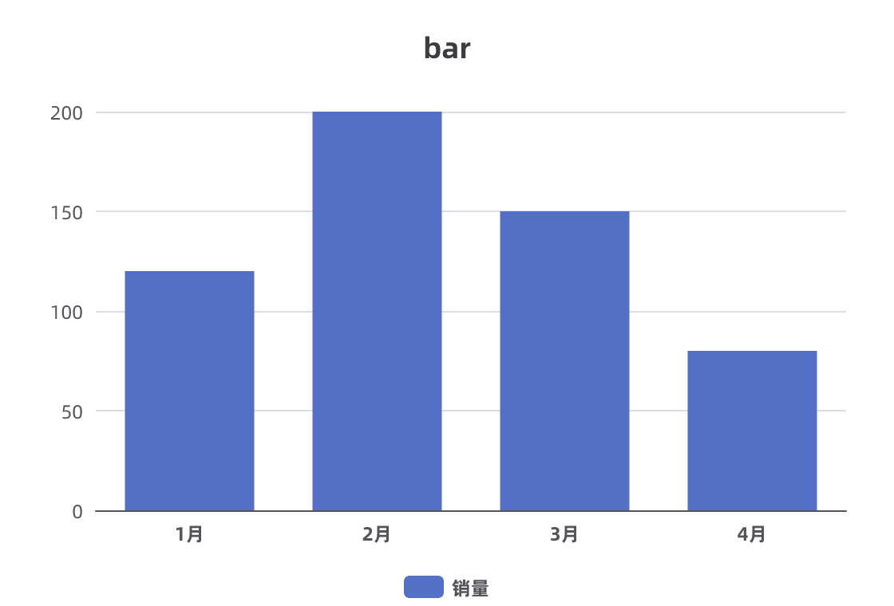

**data 结构**：Dataset：第 1 维为类目轴，其余每维一条柱系列

**示例 data**：

```json
{
  "dimensions": [
    "月份",
    "销量"
  ],
  "source": [
    [
      "1月",
      120
    ],
    [
      "2月",
      200
    ],
    [
      "3月",
      150
    ],
    [
      "4月",
      80
    ]
  ]
}
```

### 2. `line`

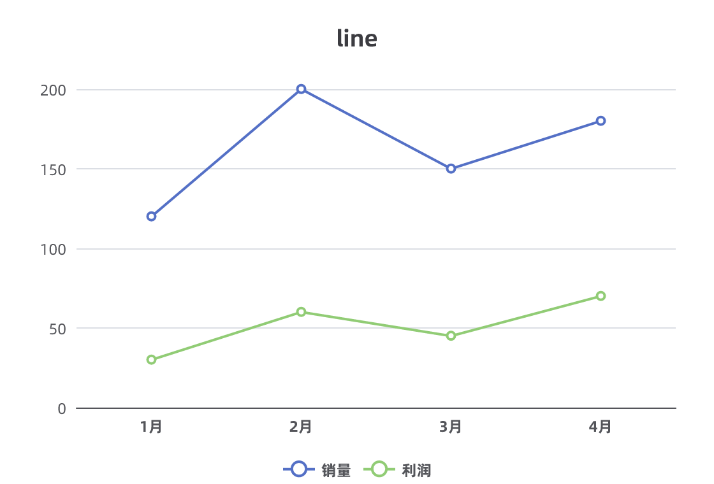

**data 结构**：Dataset：同 bar，其余每维一条折线

**示例 data**：

```json
{
  "dimensions": [
    "月份",
    "销量",
    "利润"
  ],
  "source": [
    [
      "1月",
      120,
      30
    ],
    [
      "2月",
      200,
      60
    ],
    [
      "3月",
      150,
      45
    ],
    [
      "4月",
      180,
      70
    ]
  ]
}
```

### 3. `scatter`

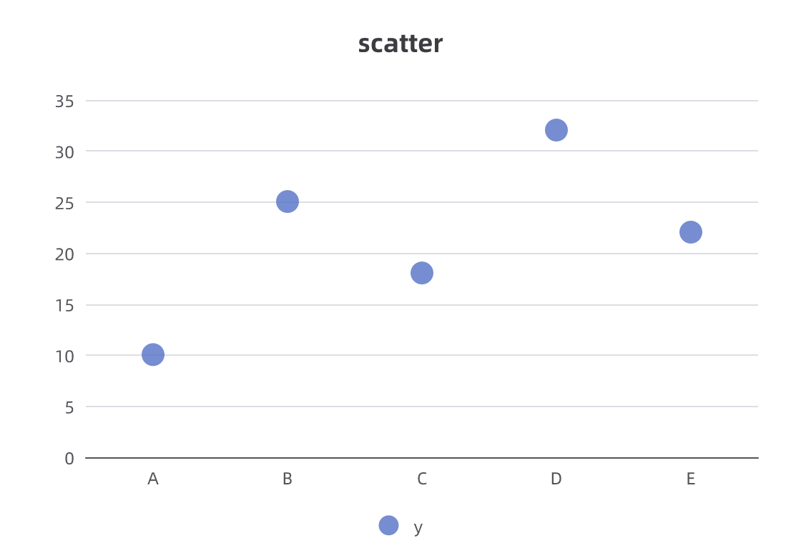

**data 结构**：Dataset：第 1 维为 x 轴类目，其余每维一组散点

**示例 data**：

```json
{
  "dimensions": [
    "x",
    "y"
  ],
  "source": [
    [
      "A",
      10
    ],
    [
      "B",
      25
    ],
    [
      "C",
      18
    ],
    [
      "D",
      32
    ],
    [
      "E",
      22
    ]
  ]
}
```

### 4. `heatmap`

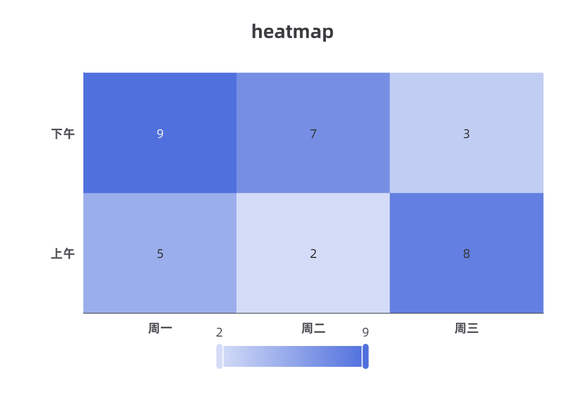

**data 结构**：Dataset：恰好 3 维 [x 类目, y 类目, 数值]

**示例 data**：

```json
{
  "dimensions": [
    "星期",
    "时段",
    "访问量"
  ],
  "source": [
    [
      "周一",
      "上午",
      5
    ],
    [
      "周一",
      "下午",
      9
    ],
    [
      "周二",
      "上午",
      2
    ],
    [
      "周二",
      "下午",
      7
    ],
    [
      "周三",
      "上午",
      8
    ],
    [
      "周三",
      "下午",
      3
    ]
  ]
}
```

### 5. `boxplot`

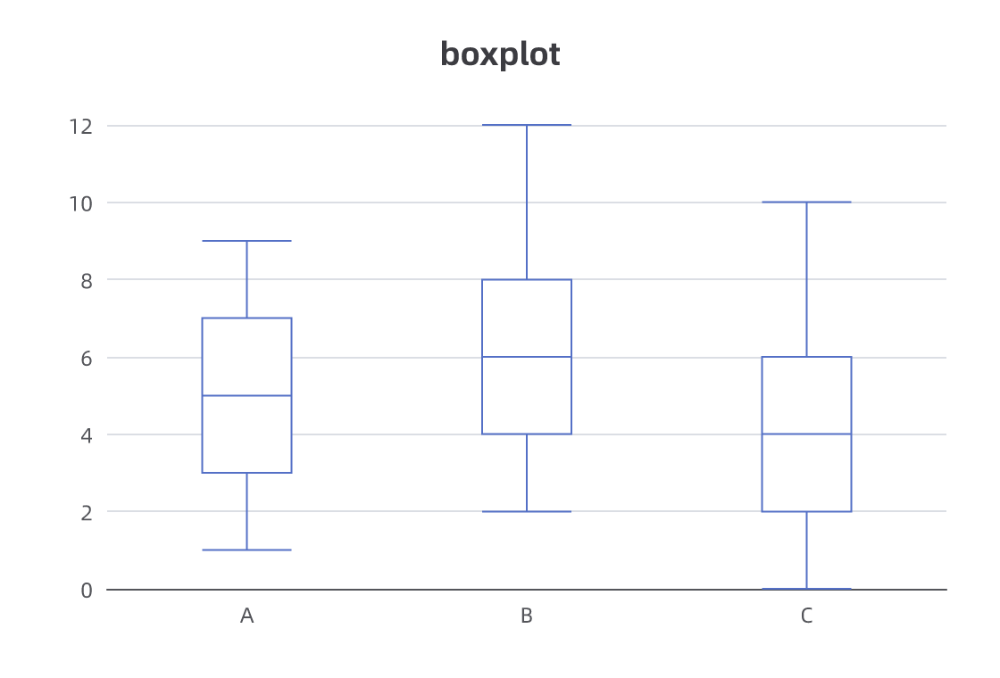

**data 结构**：Dataset：恰好 6 维 [名称, min, Q1, median, Q3, max]，五数概括需预先算好

**示例 data**：

```json
{
  "dimensions": [
    "分组",
    "min",
    "Q1",
    "median",
    "Q3",
    "max"
  ],
  "source": [
    [
      "A",
      1,
      3,
      5,
      7,
      9
    ],
    [
      "B",
      2,
      4,
      6,
      8,
      12
    ],
    [
      "C",
      0,
      2,
      4,
      6,
      10
    ]
  ]
}
```

### 6. `candlestick`

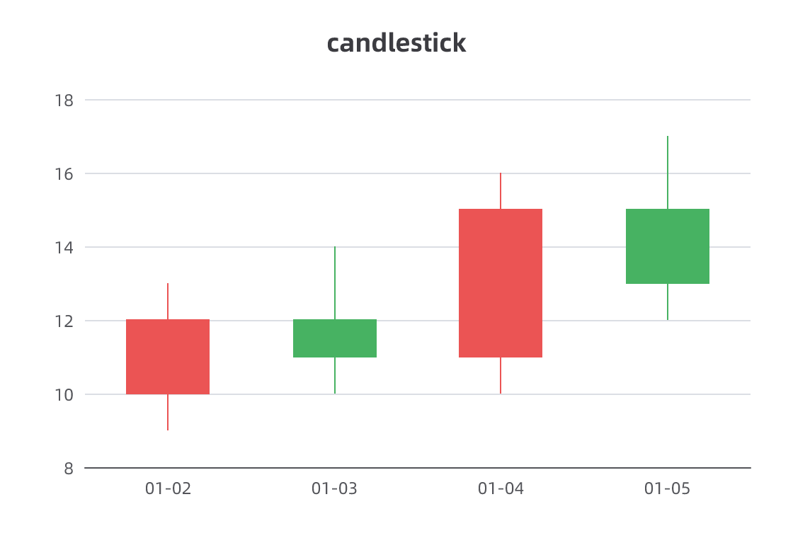

**data 结构**：Dataset：恰好 5 维 [日期, open, close, low, high]

**示例 data**：

```json
{
  "dimensions": [
    "日期",
    "open",
    "close",
    "low",
    "high"
  ],
  "source": [
    [
      "01-02",
      10,
      12,
      9,
      13
    ],
    [
      "01-03",
      12,
      11,
      10,
      14
    ],
    [
      "01-04",
      11,
      15,
      10,
      16
    ],
    [
      "01-05",
      15,
      13,
      12,
      17
    ]
  ]
}
```

### 7. `pie`

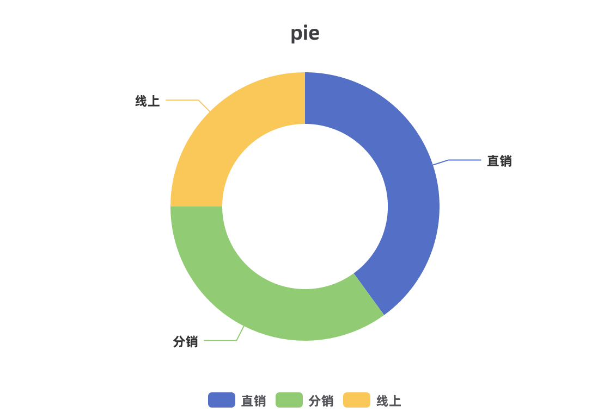

**data 结构**：Dataset：恰好 2 维 [名称, 数值]

**示例 data**：

```json
{
  "dimensions": [
    "渠道",
    "占比"
  ],
  "source": [
    [
      "直销",
      40
    ],
    [
      "分销",
      35
    ],
    [
      "线上",
      25
    ]
  ]
}
```

### 8. `funnel`

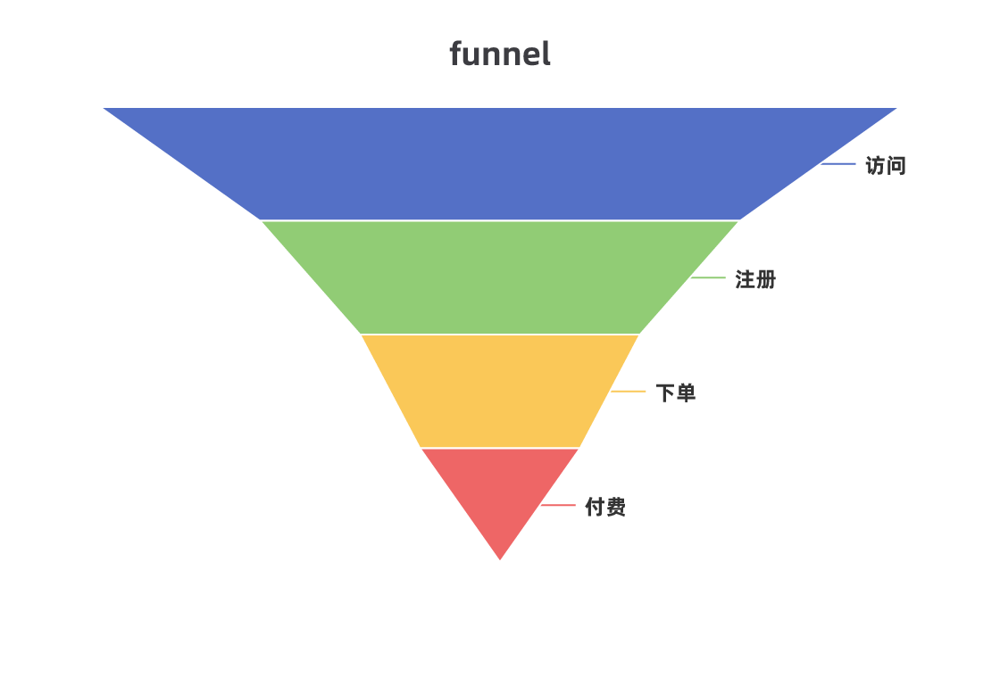

**data 结构**：Dataset：恰好 2 维 [阶段名, 数值]

**示例 data**：

```json
{
  "dimensions": [
    "阶段",
    "人数"
  ],
  "source": [
    [
      "访问",
      100
    ],
    [
      "注册",
      60
    ],
    [
      "下单",
      35
    ],
    [
      "付费",
      20
    ]
  ]
}
```

### 9. `radar`

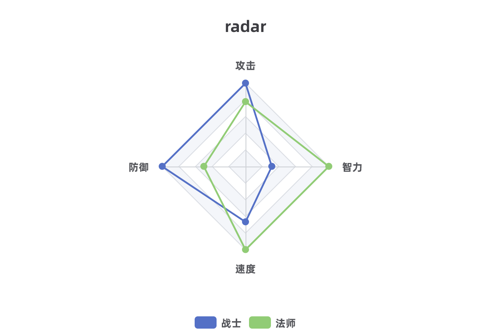

**data 结构**：Dataset：第 1 维为系列名，其余每维一个雷达指标

**示例 data**：

```json
{
  "dimensions": [
    "角色",
    "攻击",
    "防御",
    "速度",
    "智力"
  ],
  "source": [
    [
      "战士",
      90,
      80,
      40,
      30
    ],
    [
      "法师",
      70,
      40,
      60,
      95
    ]
  ]
}
```

### 10. `parallel`

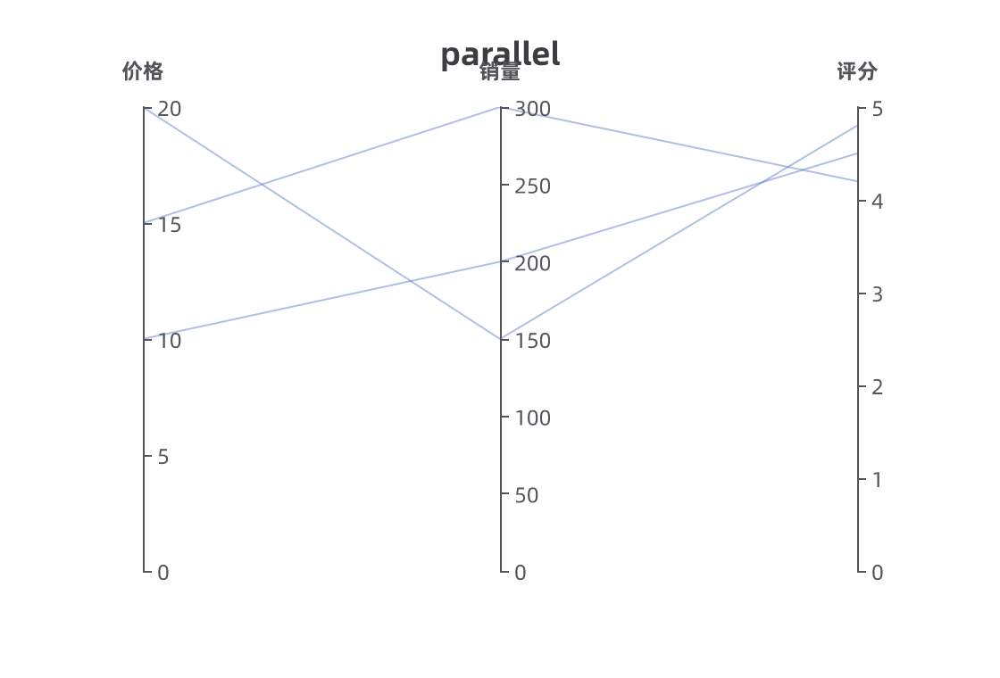

**data 结构**：Dataset：第 1 维为线名，其余每维一根平行坐标轴

**示例 data**：

```json
{
  "dimensions": [
    "样本",
    "价格",
    "销量",
    "评分"
  ],
  "source": [
    [
      "A",
      10,
      200,
      4.5
    ],
    [
      "B",
      20,
      150,
      4.8
    ],
    [
      "C",
      15,
      300,
      4.2
    ]
  ]
}
```

### 11. `treemap`

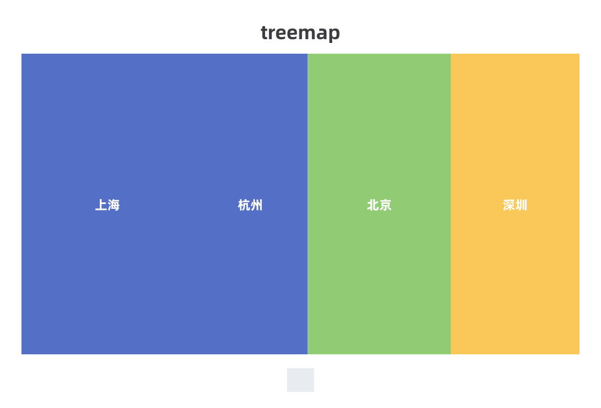

**data 结构**：Dataset：恰好 2 维 [层级路径, 数值]，路径用 / 分隔

**示例 data**：

```json
{
  "dimensions": [
    "路径",
    "销售额"
  ],
  "source": [
    [
      "华东/上海",
      120
    ],
    [
      "华东/杭州",
      80
    ],
    [
      "华北/北京",
      100
    ],
    [
      "华南/深圳",
      90
    ]
  ]
}
```

### 12. `sunburst`

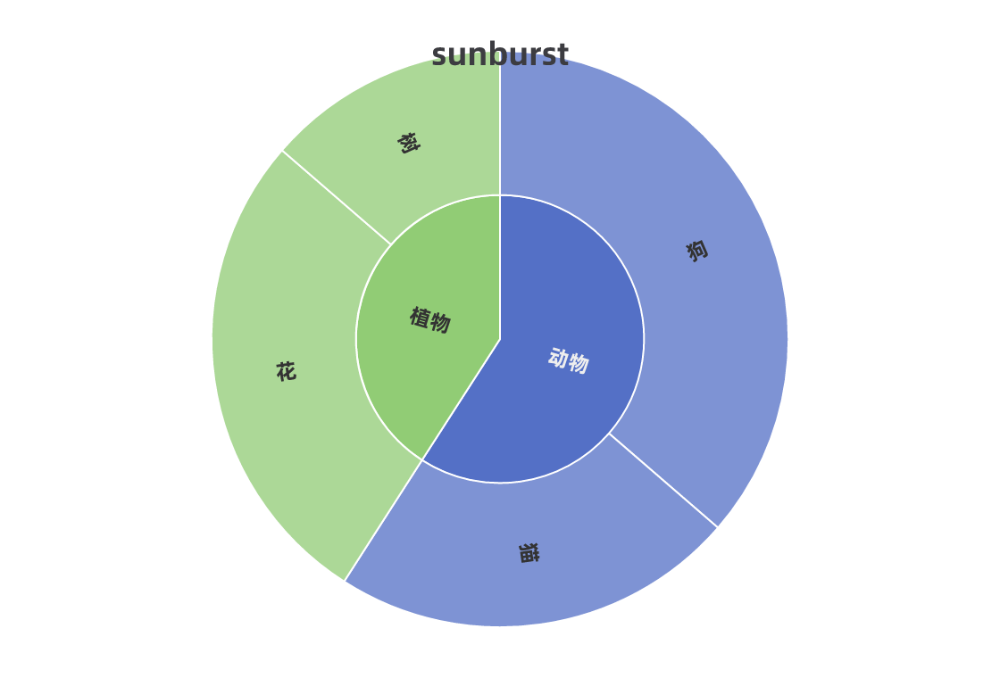

**data 结构**：Dataset：同 treemap，恰好 2 维 [层级路径, 数值]

**示例 data**：

```json
{
  "dimensions": [
    "路径",
    "数量"
  ],
  "source": [
    [
      "动物/猫",
      5
    ],
    [
      "动物/狗",
      8
    ],
    [
      "植物/树",
      3
    ],
    [
      "植物/花",
      6
    ]
  ]
}
```

---

## 3. 结构型（3 种）

### 13. `sankey`

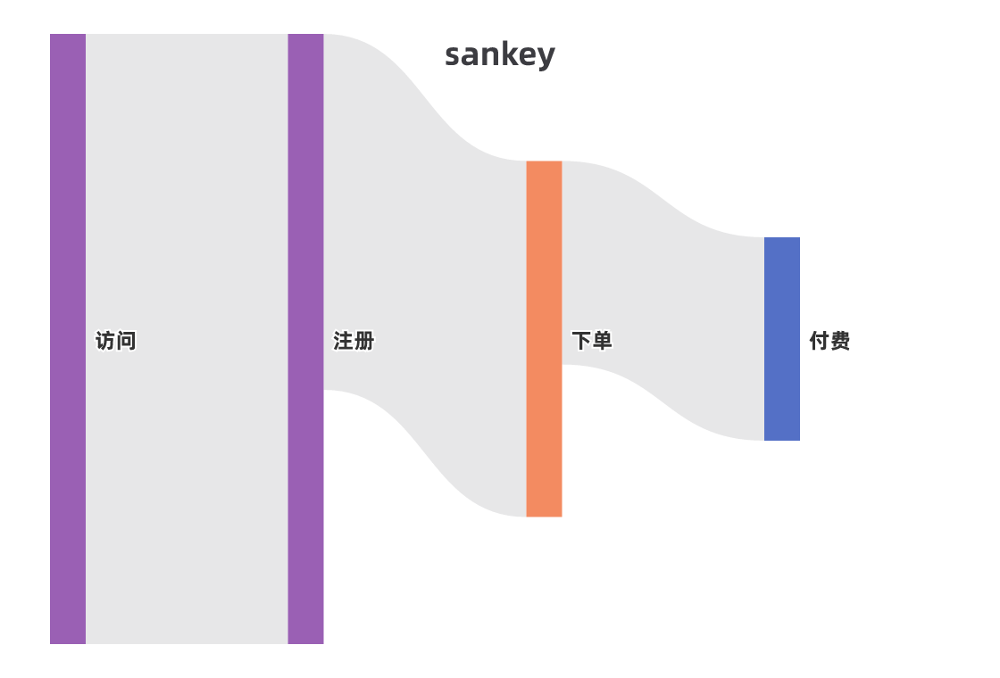

**data 结构**：NodeLinkData：{ nodes:[{name,value?}], links:[{source,target,value}] }

**示例 data**：

```json
{
  "nodes": [
    {
      "name": "访问"
    },
    {
      "name": "注册"
    },
    {
      "name": "下单"
    },
    {
      "name": "付费"
    }
  ],
  "links": [
    {
      "source": "访问",
      "target": "注册",
      "value": 60
    },
    {
      "source": "注册",
      "target": "下单",
      "value": 35
    },
    {
      "source": "下单",
      "target": "付费",
      "value": 20
    }
  ]
}
```

### 14. `graph`

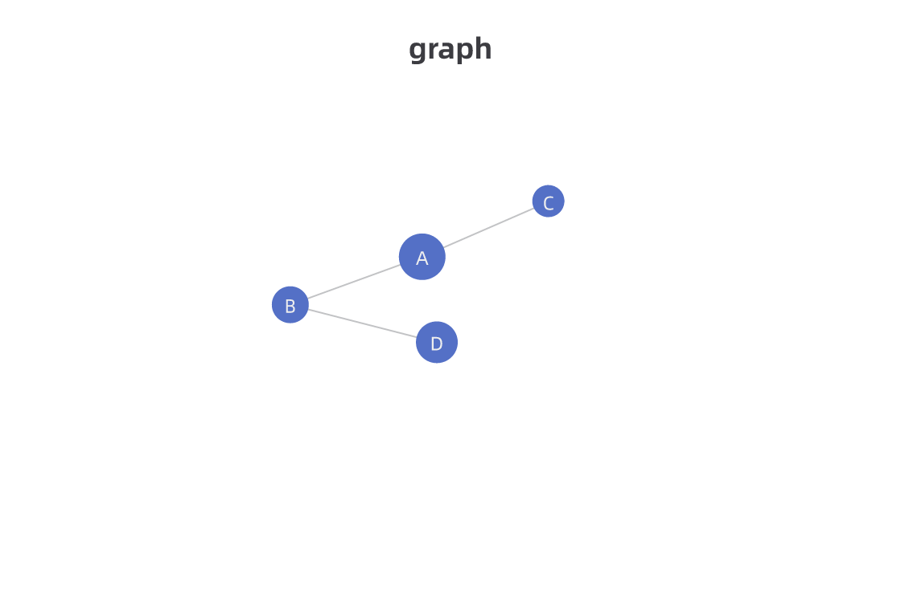

**data 结构**：NodeLinkData：同 sankey，力导向布局自动排布

**示例 data**：

```json
{
  "nodes": [
    {
      "name": "A",
      "value": 10
    },
    {
      "name": "B",
      "value": 6
    },
    {
      "name": "C",
      "value": 4
    },
    {
      "name": "D",
      "value": 8
    }
  ],
  "links": [
    {
      "source": "A",
      "target": "B"
    },
    {
      "source": "A",
      "target": "C"
    },
    {
      "source": "B",
      "target": "D"
    }
  ]
}
```

### 15. `tree`

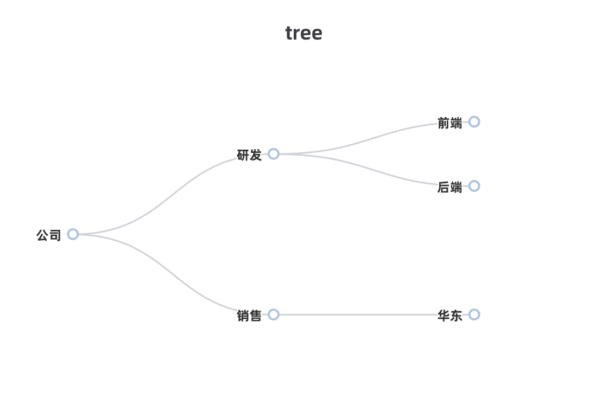

**data 结构**：TreeNode：{ name, value?, children?: TreeNode[] } 递归结构，只传一个根

**示例 data**：

```json
{
  "name": "公司",
  "children": [
    {
      "name": "研发",
      "children": [
        {
          "name": "前端"
        },
        {
          "name": "后端"
        }
      ]
    },
    {
      "name": "销售",
      "children": [
        {
          "name": "华东"
        }
      ]
    }
  ]
}
```

---

## 4. 细分样式靠 optionOverrides，不新增类型

以下 10 个样例**全部实测渲染通过**，`type` 参数始终是 `bar` / `line` / `pie` 之一，差异只在 `optionOverrides`。
这说明「每个大类下的细分小类」不需要扩展类型枚举即可覆盖。

### 16. `calendar`

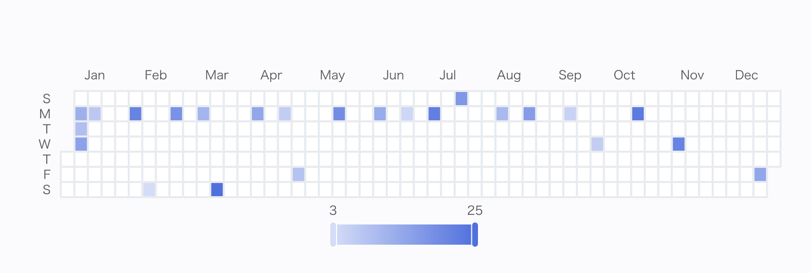

日历热力图。一格一天，用来看「哪几天忙」以及周末效应、季节性、中断段。
底层是画在 `calendar` 坐标系上的 heatmap，跨年数据会自动按年拆成多个日历。

**注意**：日期必须是 `YYYY-MM-DD`。ECharts 对认不出的日期不报错，只会把该点丢掉，
结果是一张空白日历 —— 模板会主动校验并报错，不让这种问题静默通过。

**data 结构**：Dataset：dimensions 恰好 2 项 [日期, 数值]，日期必须是 YYYY-MM-DD。跨年的数据会自动按年拆成多个日历，不需要调用方自己分组。

**示例 data**：

```json
{
  "dimensions": [
    "日期",
    "提交数"
  ],
  "source": [
    [
      "2026-01-05",
      12
    ],
    [
      "2026-01-06",
      9
    ],
    [
      "2026-01-07",
      15
    ],
    [
      "2026-01-12",
      7
    ],
    [
      "2026-02-02",
      21
    ],
    [
      "2026-02-14",
      3
    ],
    [
      "2026-02-23",
      18
    ],
    [
      "2026-03-09",
      11
    ],
    [
      "2026-03-21",
      25
    ],
    [
      "2026-04-06",
      14
    ],
    [
      "2026-04-20",
      6
    ],
    [
      "2026-05-01",
      8
    ],
    [
      "2026-05-18",
      19
    ],
    [
      "2026-06-08",
      13
    ],
    [
      "2026-06-22",
      4
    ],
    [
      "2026-07-06",
      22
    ],
    [
      "2026-07-19",
      17
    ],
    [
      "2026-08-10",
      10
    ],
    [
      "2026-08-24",
      16
    ],
    [
      "2026-09-14",
      5
    ],
    [
      "2026-09-30",
      6
    ],
    [
      "2026-10-19",
      23
    ],
    [
      "2026-11-11",
      21
    ],
    [
      "2026-12-25",
      14
    ]
  ]
}
```

### 17. `matrix`

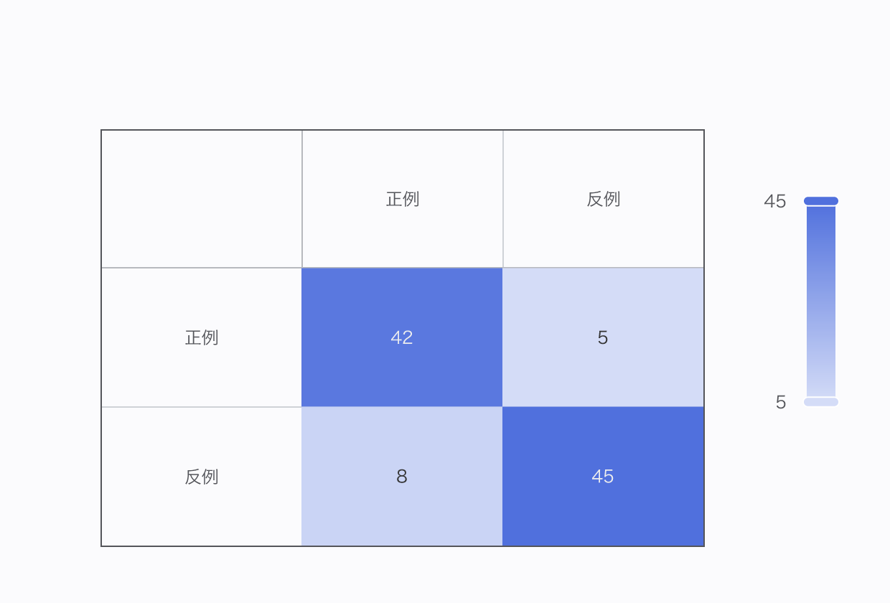

矩阵图。行列都是类目、每格一个数，画成带行列表头的表格并默认标出数值。
混淆矩阵、相关系数矩阵是最典型的两个场景。

**与 `heatmap` 的区别**：数据形状完全一样，区别在表现 —— `matrix` 是要
**逐格读数**的表格，`heatmap` 是要看分布的连续色块。类目多到读不完每一格时，用后者。

**data 结构**：Dataset：dimensions 恰好 3 项 [x 类目, y 类目, 数值]，source 每行为 [x, y, value]。与 heatmap 的数据形状相同，区别是画成带行列表头的表格。

**示例 data**：

```json
{
  "dimensions": [
    "预测",
    "实际",
    "数量"
  ],
  "source": [
    [
      "正例",
      "正例",
      42
    ],
    [
      "正例",
      "反例",
      8
    ],
    [
      "反例",
      "正例",
      5
    ],
    [
      "反例",
      "反例",
      45
    ]
  ]
}
```

### 堆叠柱状图

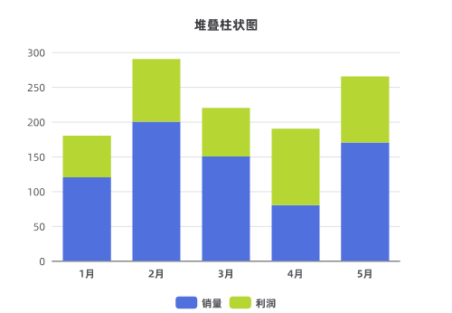

```json
{
  "optionOverrides": {
    "series": [
      {
        "stack": "总量"
      },
      {
        "stack": "总量"
      }
    ]
  }
}
```

### 横向条形图

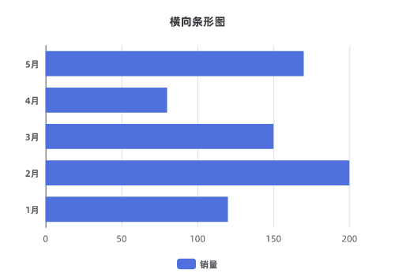

```json
{
  "optionOverrides": {
    "xAxis": {
      "type": "value",
      "data": null
    },
    "yAxis": {
      "type": "category",
      "data": [
        "1月",
        "2月",
        "3月",
        "4月",
        "5月"
      ]
    }
  }
}
```

### 极坐标柱状图

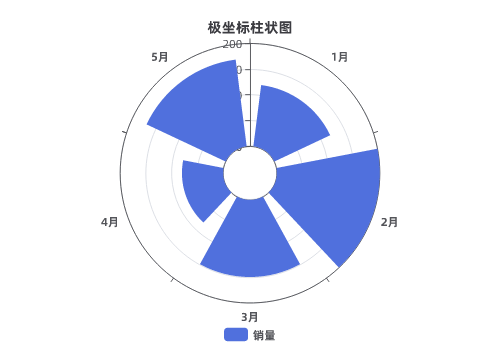

```json
{
  "optionOverrides": {
    "grid": null,
    "xAxis": null,
    "yAxis": null,
    "polar": {
      "radius": [
        28,
        "75%"
      ]
    },
    "angleAxis": {
      "type": "category",
      "data": [
        "1月",
        "2月",
        "3月",
        "4月",
        "5月"
      ]
    },
    "radiusAxis": {},
    "series": [
      {
        "coordinateSystem": "polar"
      }
    ]
  }
}
```

### 面积图

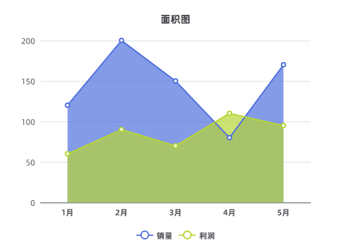

```json
{
  "optionOverrides": {
    "series": [
      {
        "areaStyle": {}
      },
      {
        "areaStyle": {}
      }
    ]
  }
}
```

### 阶梯折线图

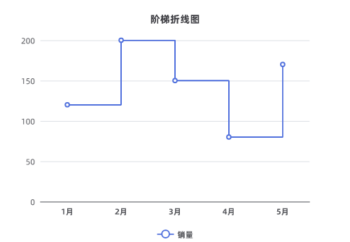

```json
{
  "optionOverrides": {
    "series": [
      {
        "step": "end"
      }
    ]
  }
}
```

### 平滑堆叠面积图

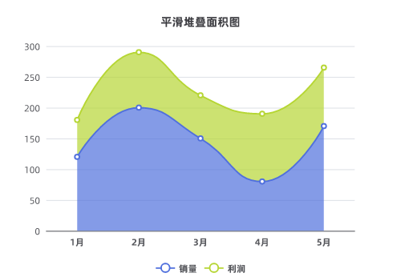

```json
{
  "optionOverrides": {
    "series": [
      {
        "smooth": true,
        "areaStyle": {},
        "stack": "t"
      },
      {
        "smooth": true,
        "areaStyle": {},
        "stack": "t"
      }
    ]
  }
}
```

### 南丁格尔玫瑰图

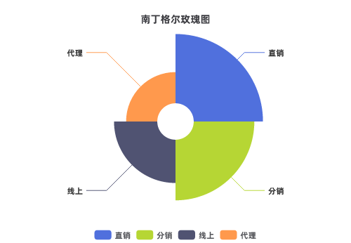

```json
{
  "optionOverrides": {
    "series": [
      {
        "roseType": "area",
        "radius": [
          "15%",
          "72%"
        ]
      }
    ]
  }
}
```

### 饼图+外部标签

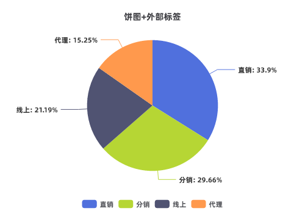

```json
{
  "optionOverrides": {
    "series": [
      {
        "radius": "62%",
        "label": {
          "show": true,
          "formatter": "{b}: {d}%"
        }
      }
    ]
  }
}
```

### 双 Y 轴组合图（柱+线）

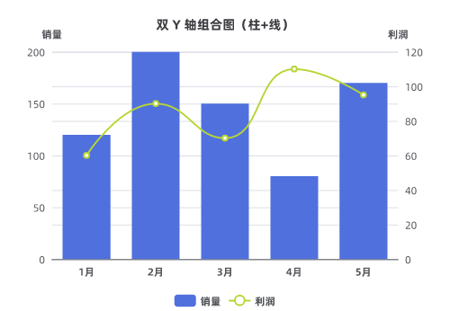

```json
{
  "optionOverrides": {
    "yAxis": [
      {
        "type": "value",
        "name": "销量"
      },
      {
        "type": "value",
        "name": "利润"
      }
    ],
    "series": [
      {},
      {
        "type": "line",
        "yAxisIndex": 1,
        "smooth": true
      }
    ]
  }
}
```

### 自定义配色+数值标签

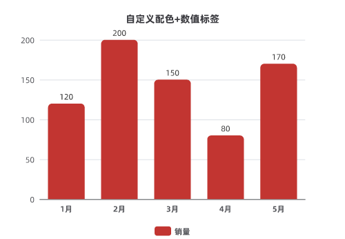

```json
{
  "optionOverrides": {
    "color": [
      "#c23531"
    ],
    "series": [
      {
        "label": {
          "show": true,
          "position": "top"
        },
        "itemStyle": {
          "borderRadius": [
            6,
            6,
            0,
            0
          ]
        }
      }
    ]
  }
}
```

---

## 5. 纯 JSON 能表达到什么程度

一个现实约束：MCP 的工具入参是 JSON，**无法传递 JavaScript 函数**。
下列 6 项 ECharts 高级能力经实测确认**纯 JSON 即可表达**，不受该约束影响：

### 气泡图：symbolSize 走逐点对象而非回调函数

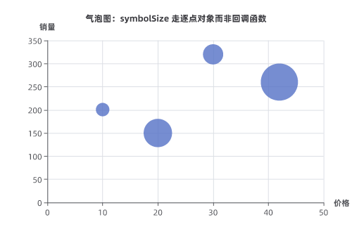

### 标签格式化：字符串模板 {b}/{c}/{d}%，非函数

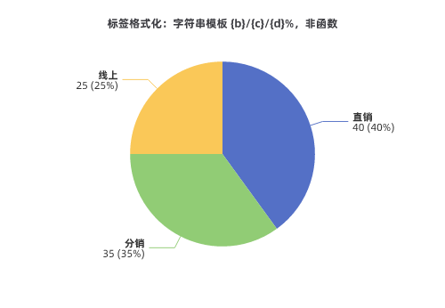

### visualMap 连续映射：纯声明式配色

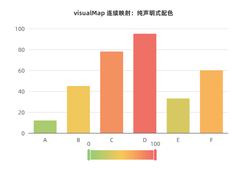

### markLine / markPoint：均值线与极值点

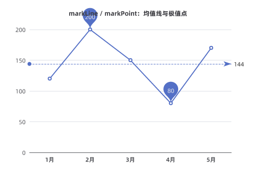

### 多 grid 分面：一张图放两个坐标系

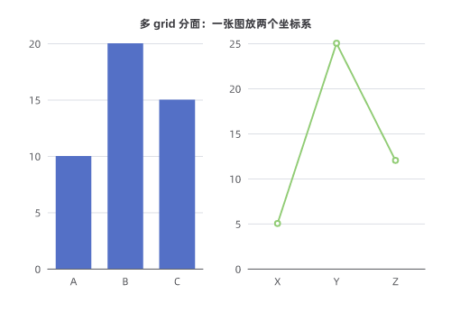

### 富文本 rich 样式与轴标签旋转

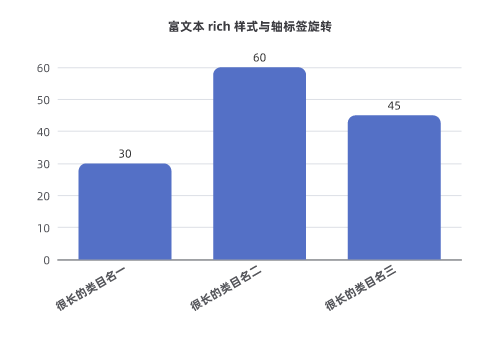

### 唯一确实受限的部分

需要写 JS 回调函数的配置项无法通过 JSON 传入。实际影响有限：

| 受限项 | 替代方案 | 是否实测 |
|---|---|---|
| `tooltip.formatter` 函数形式 | 静态图（SVG/PNG）不渲染 tooltip，该项不参与出图 | 是 |
| `label.formatter` 函数形式 | 用字符串模板 `{b}` / `{c}` / `{d}%` | 是 |
| `symbolSize` 回调形式 | 逐个数据点写成 `{ value: [...], symbolSize: n }` | 是 |

**未决问题**：是否允许在 `optionOverrides` 中传函数字符串以彻底消除该限制。
需求方尚未拍板，实施计划中已留出决策点。

---

## 6. 一期不做的类型

| 类型 | 原因 |
|---|---|
| `map` / `geo` 地图类 | 需要注册 GeoJSON 与地图数据分发，是独立子系统，spec §2.2 已明确排除 |
| `lines` 路径图 | 通常依附于地图坐标系，随地图一并推迟 |
| 3D 类（`bar3D` / `surface` 等） | 依赖 echarts-gl 与 WebGL，SSR 环境不可用 |
